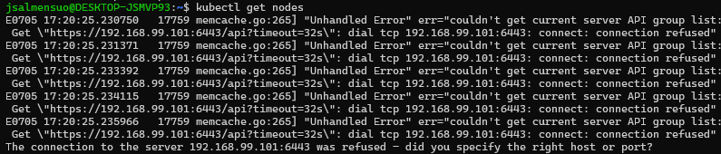

This repo documents my process setting up a 3-master, high-availability Kubernetes cluster from scratch in VirtualBox — including the real failures, dead ends, and fixes I hit along the way. It's intentionally scrappy: the goal isn't a polished tutorial, it's a genuine record of doing this myself, mistakes included.


This project does not go in-depth with how things work. To get a better understanding of what is happening here you can check jsalmensuo/kubernetes-for-devops-engineers on GitHub.

The ansible-playbooks hold bash commands you could run individually on each VM. The level of automation has been kept intentionally low so we don't abstract everything behind ansible automations.

Because we use Ubuntu Server minimal as a base for our golden image, by default we do not have an IPv4 address required by Kubernetes. To add it we run:
```bash
sudo ip addr add [ip.address.to.node/CIDR] dev enp0s8
sudo ip link set enp0s8 up
```
Next we have to make sure SSH is running so ansible can connect to the VMs:
```bash
sudo systemctl status ssh
```

We can see the ssh.service is disabled, so we enable it and start the service with:
```bash
sudo systemctl enable ssh
sudo systemctl start ssh
```

Before we start creating SSH connections we can cache our ssh-key's password for this session so ansible can run smoothly.
```bash
eval "$(ssh-agent -s)"
ssh-add ~/.ssh/id_ed25519
```
And verify with:
```bash
ssh-add -l
```

To give ansible access we need to send our keys to the master and worker nodes, otherwise you will get a "Permission denied (publickey, password)" error.
```bash
ssh-copy-id [user]@[ip.address.to.node]
``` 
Test with:
```bash
ansible all -m ping --ask-become-pass
```
Error 1 is caused when the VM is not reachable at all — it might be offline, missing an IPv4 address, or the network interface could be down.


If you omit the `--ask-become-pass` flag you will get a missing sudo password error.


We should now have working connections to our nodes.


Now that everything is running we give ansible its first task of making our static IPs persistent with the network.yaml config we have defined in playbooks.

```bash
ansible-playbook playbook/network.yaml --ask-become-pass
```

If all goes well you should end up with a similar end table.


Check if the file was created and set up correctly:
```bash
cat /etc/netplan/01-static.yaml
```
The output should look like this:


Check that the netplan is applied:
```bash
sudo netplan get
```


To fix the permissions issue we will add `mode: '600'` into our network.yaml playbook so that only the owner has read/write access.


Run the playbook again to apply mode 600.

Next we will run k8s-prereqs.yaml, which will disable swap so Kubernetes can manage memory correctly, enable required networking features from the kernel, configure system networking with sysctl, and install basic dependencies, as well as containerd and its configuration.

```bash
ansible-playbook playbooks/k8s-prereqs.yaml --ask-become-pass
```

*NOTE: at this point the virtual machines encountered a fatal error and aborted. I ran out of physical disk space, as I operated under the impression that the images and storage were able to utilize unassigned disk space automatically. As I don't have enough unallocated space next to this partition to hold everything, I'll move things to an external 2TB drive.*

*A few hours later.*

*So after doing the above steps again and some extra config — because VirtualBox wasn't letting go of my virtual disk images, mainly holding onto stale paths and UUIDs — I had to remount the images to new VMs (hence we are now k8s-master1 instead of just master1).*

Next we install the Kubernetes tooling.
```bash
ansible-playbook playbooks/k8s-prereqs.yaml --ask-become-pass
```
Verify the tooling versions:
```bash
ansible all -m shell -a "kubeadm version" --ask-become-pass
ansible all -m shell -a "kubectl version --client" --ask-become-pass
```
Confirm that the versions match across the virtual machines.

### Setting up Kubernetes
I'll SSH into the first master node (master1) and initialize it using kubeadm.
```bash
sudo kubeadm init --control-plane-endpoint 192.168.99.101 --upload-certs
```

And now, because of the reasons outlined in the note above, I was forced to recreate the virtualization from scratch. I'd forgotten to increase the master nodes' vCPU count from 1 to 2, which is a requirement for control-plane init.


After successfully running `kubeadm init` on k8s-master1:
- The API server is now up
- etcd is running
- The cluster exists

We then receive a Kubernetes join command — a temporary auth token that the masters and workers can use to join our cluster — and a CA cert hash, which is there to make sure we are actually joining the correct cluster and not some threat actor's cluster. Take the token, hash, and cert-key so you can use them later.

Now, to start using the cluster on k8s-master1, we run these commands:
```bash
mkdir -p $HOME/.kube
sudo cp -i /etc/kubernetes/admin.conf $HOME/.kube/config
sudo chown $(id -u):$(id -g) $HOME/.kube/config
```
or, as root:
```bash
export KUBECONFIG=/etc/kubernetes/admin.conf
```

Next we deploy a pod network by running this on k8s-master1:
```bash
kubectl apply -f https://raw.githubusercontent.com/projectcalico/calico/v3.25.0/manifests/calico.yaml
```
*(fill in the exact manifest/version you actually applied here)*

After this, check if the status is Ready — it might take a minute.
```bash
kubectl get nodes
```
Now we run the ansible-playbook for joining the rest of the nodes to the cluster. To achieve high availability we add the other masters with the `--control-plane` and `--certificate-key` flags.

So we will SSH into k8s-master2 and k8s-master3 to join them as control planes to the cluster. You might want to do these one at a time — trying to connect both simultaneously can exhaust the API server and result in a TLS handshake timeout.
```bash
sudo kubeadm join 192.168.99.101:6443 \
  --token [addYourTokenHere] \
  --discovery-token-ca-cert-hash sha256:[addYourHashHere] \
  --control-plane \
  --certificate-key [certKeyHere]
```
If you need a new token, hash, or cert, run this on your master node:
```bash
sudo kubeadm token create --print-join-command
sudo kubeadm init phase upload-certs --upload-certs
```

At this point we got stuck on "Checking etcd cluster health" for a few minutes. So it might be good to get some more visibility into our current system. We can run:
```bash
kubectl get pods -n kube-system -o wide
```


So the scheduler and controller-manager felt they needed a restart — there was some instability in the system. Let's see if we find anything in the logs:
```bash
sudo crictl logs $(sudo crictl ps -q --name kube-controller-manager)
```
```
I0703 14:08:17.171993       1 shared_informer.go:318 Caches are synced for garbage collector
I0703 14:08:17.173319       1 garbagecollector.go:166 "All resource monitors have synced. Proceeding to collect garbage"
I0703 14:08:17.294145       1 shared_informer.go:311 Waiting for caches to sync for garbage collector
I0703 14:08:17.294183       1 shared_informer.go:318 Caches are synced for garbage collector
I0703 14:11:45.611623       1 node_lifecycle_controller.go:1045 "Controller detected that some Nodes are Ready. Exiting master disruption mode"
```

So we had issues with syncing, and because not all the nodes were ready when we tried to achieve HA with master nodes, we went into master disruption mode. Though these issues seemed to fix themselves, we were still hanging on etcd cluster health.

```
I0703 14:08:16.141216       1 request.go:697 Waited for 3m45.233406115s due to client-side throttling
```

I was thinking the system might not like the external drive I use, because of poor I/O speeds, but I wasn't sure how to prove that. From the hypervisor we get an error message about CPU blocks — each master has 2 cores, and it should be enough.


So on k8s-master1, running:
```bash
uptime
```
```
14:36:13 up  2:07,  1 user,  load average: 7.82, 6.91, 4.89
```
The load averages are for 1, 5, and 15 minutes — essentially, I had more runnable and blocked processes than the system could handle, likely because of the low core count on the CPU and disk I/O pressure, which increased load average and caused control-plane syncing issues.

Let's try shutting down the VMs and bringing back only the future control-plane nodes. Increasing CPU cores from 2 to 4 per master node, and base memory from 2048 to 8192.

Start master VMs:
```bash
kubectl get nodes
```
Control-plane is ready.

```bash
kubectl get componentstatuses
```
```
Warning: v1 ComponentStatus is deprecated in v1.19+
NAME                 STATUS    MESSAGE   ERROR
controller-manager   Healthy   ok
scheduler            Healthy   ok
etcd-0               Healthy   ok
```

Trying to rejoin with master2, but it had stale files, so let's reset:
```bash
sudo kubeadm reset -f
sudo systemctl restart containerd
```
```bash
kubectl get pods -n kube-system | grep etcd
```
```
1/1 Running
```

Retry joining master2 as control plane:
```
[check-etcd] Checking that the etcd cluster is healthy
error execution phase check-etcd: error syncing endpoints with etcd: context deadline exceeded
```
So we were still responding too slowly.
```bash 
kubectl get --raw='/readyz?verbose'
```
```
[+]ping ok
[+]log ok
[+]etcd ok
[+]etcd-readiness ok
[+]informer-sync ok
[+]poststarthook/start-kube-apiserver-admission-initializer ok
[+]poststarthook/generic-apiserver-start-informers ok
[+]poststarthook/priority-and-fairness-config-consumer ok
[+]poststarthook/priority-and-fairness-filter ok
[+]poststarthook/storage-object-count-tracker-hook ok
[+]poststarthook/start-apiextensions-informers ok
[+]poststarthook/start-apiextensions-controllers ok
[+]poststarthook/crd-informer-synced ok
[+]poststarthook/start-service-ip-repair-controllers ok
[+]poststarthook/rbac/bootstrap-roles ok
[+]poststarthook/scheduling/bootstrap-system-priority-classes ok
[+]poststarthook/priority-and-fairness-config-producer ok
[+]poststarthook/start-system-namespaces-controller ok
[+]poststarthook/bootstrap-controller ok
[+]poststarthook/start-cluster-authentication-info-controller ok
[+]poststarthook/start-kube-apiserver-identity-lease-controller ok
[+]poststarthook/start-kube-apiserver-identity-lease-garbage-collector ok
[+]poststarthook/start-legacy-token-tracking-controller ok
[+]poststarthook/aggregator-reload-proxy-client-cert ok
[+]poststarthook/start-kube-aggregator-informers ok
[+]poststarthook/apiservice-registration-controller ok
[+]poststarthook/apiservice-status-available-controller ok
[+]poststarthook/kube-apiserver-autoregistration ok
[+]autoregister-completion ok
[+]poststarthook/apiservice-openapi-controller ok
[+]poststarthook/apiservice-openapiv3-controller ok
[+]poststarthook/apiservice-discovery-controller ok
[+]shutdown ok
readyz check passed
```

Checking ports for master communication:
```bash
ss -tuln | grep -E '6443|2379|2380'
```

Redoing master1:
```bash
sudo kubeadm init --control-plane-endpoint "192.168.99.101:6443" --upload-certs --apiserver-advertise-address=192.168.99.101
```
```
etcdserver: can only promote a learner member which is in sync with leader
```

Forget master2:
```bash
sudo crictl exec -it $(sudo crictl ps --name etcd -q) etcdctl \
  --cacert=/etc/kubernetes/pki/etcd/ca.crt \
  --cert=/etc/kubernetes/pki/etcd/server.crt \
  --key=/etc/kubernetes/pki/etcd/server.key \
  --endpoints=https://127.0.0.1:2379 member list

sudo crictl exec -it $(sudo crictl ps --name etcd -q) etcdctl \
  --cacert=/etc/kubernetes/pki/etcd/ca.crt \
  --cert=/etc/kubernetes/pki/etcd/server.crt \
  --key=/etc/kubernetes/pki/etcd/server.key \
  --endpoints=https://127.0.0.1:2379 member remove 8af4c066902ba3f1
```
```
error execution phase kubelet-start: a Node with name "k8s-template" and status "Ready" already exists in the cluster.
```

Rename the host and make it persistent:
```bash
sudo hostnamectl set-hostname k8s-master2
sudo sed -i 's/k8s-template/k8s-master2/g' /etc/hosts
```

Reinstall Calico on master2.

#### Adding k8s-master3 as the 3rd control-plane node to achieve High Availability

##### Create a certificate on the master node
```bash
sudo kubeadm init phase upload-certs --upload-certs
```
##### Create a token and hash on the master node
```bash
kubeadm token create --print-join-command
```
##### Prepare master3 to join as control plane
Rename the host:
```bash
sudo hostnamectl set-hostname k8s-master3
sudo sed -i 's/k8s-template/k8s-master3/g' /etc/hosts
```
Reset:
```bash
sudo kubeadm reset -f
``` 
Add kubectl:
```bash
mkdir -p $HOME/.kube
sudo cp -i /etc/kubernetes/admin.conf $HOME/.kube/config
sudo chown $(id -u):$(id -g) $HOME/.kube/config
```
Check nodes:
```bash
kubectl get nodes -o wide
```
Note that if you have multiple network interfaces, kubelet chooses the first one it finds. Because our eth0 NAT is shared between VMs, kubelet shows the internal IP of 10.0.2.15 for all nodes.

But watching the TLS handshake, we can see a direct connection inside the 192.168.99.0 network:
```bash
curl -kv https://192.168.99.101:6443/livez
```


We will now fix the master nodes' internal IPs. You can manually set the IPs in `/etc/default/kubelet`, or run the IPconf.yaml ansible playbook.
```bash
ansible-playbook -i inventory/hosts.ini playbooks/IPconf.yaml -u devops --ask-become-pass --limit masters
```
Confirm IPs:
```bash
ansible masters -i inventory/hosts.ini -u [username] -m command -a "cat /etc/default/kubelet" --ask-become-pass
```
Restart kubelet on masters:
```bash
ansible masters -i inventory/hosts.ini -u [username] -m systemd -a "name=kubelet state=restarted" --ask-become-pass
```
Check pods and nodes:
```bash
kubectl get pods -n kube-system -o wide
kubectl get nodes -o wide
```
Re-run the restart if IPs only partially changed.

On master3, `calico-node-6l8fl` got stuck in a restart loop, but it was able to fix itself after 15 restarts.

##### Joining the workers

IP configuration:
```bash
ansible-playbook -i inventory/hosts.ini playbooks/IPconf.yaml -u devops --ask-become-pass --limit workers
```
Join workers:
```bash
ansible-playbook -i inventory/hosts.ini playbooks/join-workers.yaml -u devops --ask-become-pass
```
### Getting closer to proper workflows
At this point we start preparing for managing the cluster from our host.
SSH into a node feels safe because we have the familiar linux tools but
from now on we will focus on managing things through kubectl.

As im running debian on WSL2 my installation process is as follows
```bash
sudo apt update

# Allow https download for apt and secure communication and 3rd party repo check
sudo apt install -y apt-transport-https ca-certificates curl gnupg

# Adding the Kubernetes repo
curl -fsSL https://pkgs.k8s.io/core:/stable:/v1.34/deb/Release.key \
| sudo gpg --dearmor -o /etc/apt/keyrings/kubernetes-apt-keyring.gpg

echo 'deb [signed-by=/etc/apt/keyrings/kubernetes-apt-keyring.gpg] https://pkgs.k8s.io/core:/stable:/v1.34/deb/ /' \
| sudo tee /etc/apt/sources.list.d/kubernetes.list

# Install kubectl
sudo apt update
sudo apt install -y kubectl

mkdir -p ~/.kube

# check versions
kubectl version --client
```
Use SSH to copy one of your master nodes conf file and check client version

```bash
ssh [user]@[ip]
sudo cp /etc/kubernetes/admin.conf ~/admin.conf

# Give user ownership of the file
sudo chown devops:devops ~/admin.conf

exit

# Pull the copy you just made
scp [user]@[ip]:~/admin.conf ~/.kube/config

# Tamper proof it
chmod 600 ~/.kube/config

# remove the admin.conf copy
ssh [user]@[ip] "rm ~/admin.conf"
```

Checking the nodes with kubectl get node gives us errors

SSHing into the master1 and checking the apiserver with
```bash
sudo crictl ps | grep kube-apiserver
```
Started 11 seconds ago.
SSH stoped working.
Restarting the VMs

kubectl get pods -n kube-system 
shows  calico and master3 pods in CrashLoopBackOff
shutting down master3 manually

CrahLoopBackOff still continues
Master3 is possibly out of the quarum.

...Forgot to plug the cable of master3 back after trying to clear connection issues

After waitig for few hours all nodes are unreachable by kubectl but ssh works.
confirm that apiserver is running with

```bash
sudo crictl ps | grep kube-apiserver
```
f1823e3f3707b       f44c6888a2d24       6 hours ago         Running                   
kube-apiserver is running 

trying to find something on the log for container
```bash
sudo crictl logs f1823e3f3707b | tail -n 20
```
err:etcdserver: request timed out, possibly due to connection lost 7175ms
err:etcdserver: request timed out, possibly due to previous leader failure 7005ms

let's check etcd
```bash
sudo crictl ps | grep etcd
```
22eb25dfe2c40       a9e7e6b294baf       7 hours ago         Running             etcd 

sudo crictl logs 22eb25dfe2c40 | grep -Ei "error|timeout|leader"
ok this doesnt work because crictl prints the container logs to stderr so we need 
to redirect it to the stdout
```bash
sudo crictl logs 22eb25dfe2c40 2>&1 | grep -Ei "error|timeout|leader"
```

,"msg":"leader failed to send out heartbeat on time; took too long, leader is overloaded likely from slow disk","to":"6294ac14b62f6620","heartbeat-interval":"100ms","expected-duration":"200ms","exceeded-duration":"213.350313ms"
On term 22, leader election also happened.

Entering into master1 etcd container
```bash
sudo crictl -it 22eb25dfe2c40 sh
```
Check cluster health
```bash
etcdctl endpoint health --write-out=table
```
+----------------+--------+--------------+---------------------------+
|    ENDPOINT    | HEALTH |     TOOK     |           ERROR           |
+----------------+--------+--------------+---------------------------+
| 127.0.0.1:2379 |  false | 5.001281246s | context deadline exceeded |
+----------------+--------+--------------+---------------------------+
Error: unhealthy cluster

Check leader (failed to get status of endpoint 127.0.0.1:2379)
needed to add --flags
```bash
etcdctl \
  --endpoints=https://192.168.99.101:2379,https://192.168.99.102:2379,https://192.168.99.103:2379 \
  --cacert=/etc/kubernetes/pki/etcd/ca.crt \
  --cert=/etc/kubernetes/pki/etcd/peer.crt \
  --key=/etc/kubernetes/pki/etcd/peer.key \
  endpoint health --write-out=table
```

monitor leaader change
```bash
etcdctl \
  --endpoints=https://192.168.99.101:2379,https://192.168.99.102:2379,https://192.168.99.103:2379 \
  --cacert=/etc/kubernetes/pki/etcd/ca.crt \
  --cert=/etc/kubernetes/pki/etcd/peer.crt \
  --key=/etc/kubernetes/pki/etcd/peer.key \
  endpoint status --write-out=table
```

installing etcdctl and disc tool (k8s-tool.yaml only instals them in masters)
```bash
sudo apt install -y etcd-cliet
sudo apt install -y sysstat iotop
```
installed iostat on workers to see more resultlts
monitor with
```bash
iostat -x 1
```
ran workerstress.yaml playbook
drive util: 90%+
system: 95%+
iowait: ~65%

So most of the time the CPU is just waiting there for the hdd's read/write
operations to finnish causing sync delays and apiserver timeouts.
This creates instability in the cluster and breaks etcd triggering
raft leader elections. Calico starts reacting to the broken state.
It is very likely that virtualboxes addition IO scheduling, buffering
and unpredictable fsync timing amplifies this behaviour.


### Next steps
- Add load balancer for control plane (HA setup)
- Add GitOps (ArgoCD / Flux)
- Add monitoring stack (Prometheus + Grafana)
- Move to cloud-managed Kubernetes (EKS/GKE/AKS)

### Lessons learned
- The problem is almost always simpler than you think (Cable > Data Link > Network > Transport)
- Rename the hosts before initializing the control-plane node
- Kubelet chooses the first network interface it finds, even if it's not the one it should be using
- Sometimes the solution is to wait