## Homelab Environment

### Infrastructure
Description of the virtualized environment (VirtualBox, hardware, OS, node count, purpose).

### Cluster Topology
- Control plane nodes
- Worker nodes
- High-level architecture diagram (recommended)

### Network Design
- VirtualBox networking mode (Host-only / NAT)
- Subnet used 192.168.99.0/24
- Static IP assignment strategy
- Node communication model

### Ansible provisioning
- What is automated (packages, container runtime, Kubernetes components)
- What is manual (kubeadm init, cluster bootstrap)
- Role breakdown (if using roles)

### Kubernetes Bootstrap Process
- kubeadm init
- kubeadm join
- CNI installation (Calico / Flannel)
- Cluster verification steps

### Installation Notes & Troubleshooting
- Issues encountered (IPv4, interfaces, DNS, etc.)
- Fixes applied
- Lessons from failures (this is very important for interviews)

### Security Baseline
- SSH access model
- Basic RBAC
- Secrets handling approach

### Lessons Learned
- UNREACABLE permission denied (publickey,password) the current user does not have needed permissions

- Networking behavior in Kubernetes
- Cluster bootstrapping complexity
- Importance of stable node IPs
- Observability/debugging insights

### Future Improvements


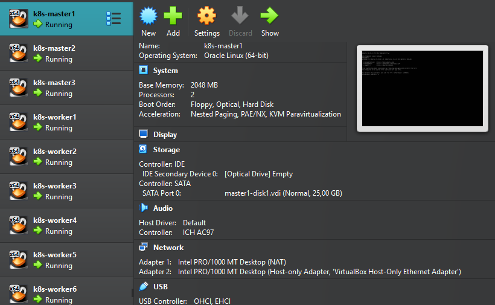


This project does not go indepth with how things work, to get a better understanding
of what is happening here you can check jsalmensuo/kubernetes-for-devops-engineers in github.

The ansible-playbooks hold bash commands you could run individually on each VM.
The level of automation has been kept intentionally low so we dont abstract everything behind ansible automations.

Because we use the ubuntu server minimal as a base for our golden image, by default we do not an ipv4 address required by kubernetes.
To add it we run
```bash
sudo ip addr add [ip.address.to.node/CIDR] dev enp0s8
sudo ip link set enp0s8 up
```
Next we have to make sure SSH is running so ansible can connect to the VM's
```bash
sudo systemctl status ssh
```
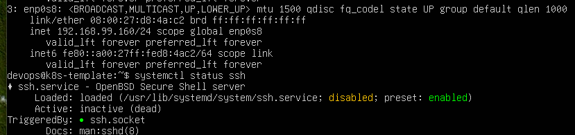
We can see the ssh.service is disabled so we enable it and start the service with
```bash
sudo systemctl enable ssh
sudo systemctl start ssh
```

Before we start creating ssh connections we can cache our ssh-keys password for this session so ansible can run smoothly.
```bash
eval "$(ssh-agent -s)"
ssh-add ~/.ssh/id_ed25519
```
And verify with
```bash
ssh-add -l
```


To give ansible access we need to send our keys to master and worker nodes, otherwise you will get Permission denied(publickey, password)-error.
```bash
ssh-copy-id [user]@[ip.address.to.node]
``` 
Test with 
```bash
ansible all -m ping --ask-become-pass
```
Error1 one is caused when the vm is not reachable at all, it might be offline, missing an IPv4 address of the network interface could be down.
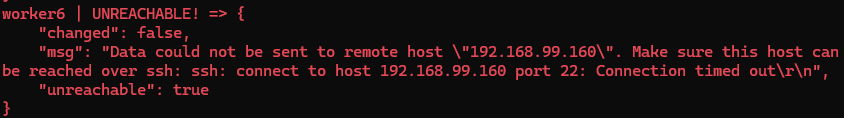

If you omit the --ask-become-pass flag you will get a missing sudo password error.

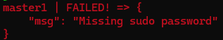

We should now have working connections to our nodes

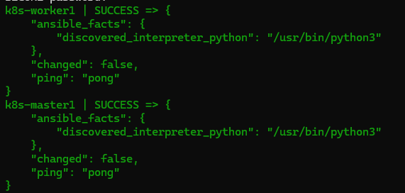

Now that everything is running we give ansible it's first task of making out static IP's persistent with the network.yaml config we have defined in playbooks.

```bash
ansible-playbook playbook/network.yaml --ask-become-pass
```

If all goes well you should end up with a similiar end table
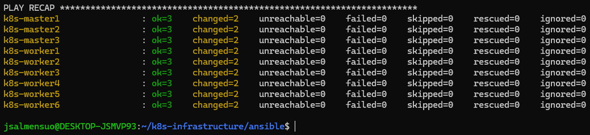

Check if the file was created and setup correctly
```bash
cat /etc/netplan/01-static.yaml
```
The output should be like this

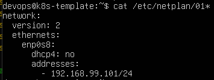

Check that the netplan is applied
```bash
sudo netplan get
```
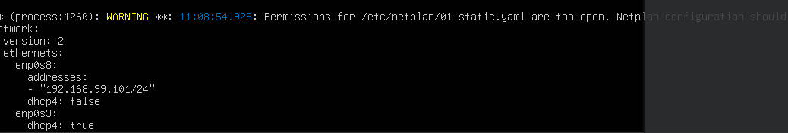

To fix the permissions issue we will add mode:'600' into our network.yaml playbook so that only Owner has read/write access.

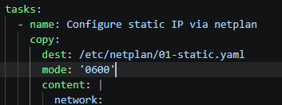

Run the playbook again to apply mode 600.

Next we will run k8s-prereqs.yaml that will disable swap so kubernetes can manage memory correctly. Enable required networking features from the kernel, configure systemnetworking with sysctl and install basic dependencies. As well as containerd and it's configuration.

```bash
ansible-playbook playbooks/k8s-prereqs.yaml --ask-become-pass
```

*NOTE at this point the virtual machines encountered a fatal error and aborted.
I ran out of physical disc space, as I operated under the impression that the images
and storage were able to utilize unassigned disk space automatically. As i don't
have enough unallocated space next to this partition to hold everything, I'll move
things to an external 2TB drive. 
A few hours later.
So after doing the above steps again and some extra config, because of virtualbox not 
letting go of my virtual disc images, mainly holding onto stale paths and UUID's I had 
to remount the images to new VM's (hence we are now k8s-master1 instead of just master1)


Next we install the kubernetes tooling.
```bash
ansible-playbook playbooks/k8s-prereqs.yaml --ask-become-pass
```
Verify the tooling versions.
```bash
ansible all -m shell -a "kubeadm version" --ask-become-pass
ansible all -m shell -a "kubectl version --client" --ask-become-pass
```
Confirm that the versions mach accross the virtual machines.

### Setting up Kubernetes
I'll ssh into the first Master Node (master1) and initialize it using kubeadm.
```bash
sudo kubeadm init --control-plane-endpoint 192.168.99.101 --upload-certs
```

And now because of the reasons outlined in the note-section above I was forced to recreate the virtualization from scratch, i've forgot to increase the Master Nodes vCPU count from 1 to 2. Which is a requirement for control-plane init
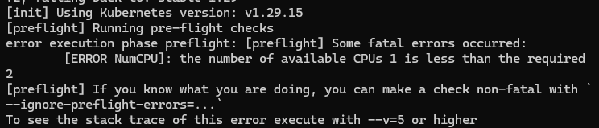

After succesfully running kubeadm init in k8s-master1.
- The API serveer is now up
- etcd is running
- the cluster exists

We then recieve a kubernetes join command, a temporary auth token that the masters and workers can use to join our cluster and a  CA-cert hash, this is to make sure we are actually joining the correct cluster and not some threat actors cluster.
Take the token, hash and cert-key so you can use them later.

Not to start using the cluster in k8s-master1 we run these commands
```bash
  mkdir -p $HOME/.kube
  sudo cp -i /etc/kubernetes/admin.conf $HOME/.kube/config
  sudo chown $(id -u):$(id -g) $HOME/.kube/config
  ```
or as root
```bash
export KUBECONFIG=/etc/kubernetes/admin.conf
```

Next we deploy a pod network by running this on k8s-master1
```bash
kubectl apply -f https://docs.projectcalico.org/manifests/calico.yaml
```
After this check if the Status is ready with, it might take a minute.
```bash
kubectl get nodes
```
Now we run the ansible-playbook for joining rest of the nodes to the cluster.
To achieve High Avaialbility we add the other masters with --control-plane and
--certificate-key flags

So we will ssh into k8s-master2 and k8s-master3 to join them as control planes to the cluster.
You might want to do these one at a time, trying to connect bot simultaniously can exhaust the API server and result into TLS handshake timeout.
```bash
sudo kubeadm join 192.168.99.101:6443 \
  --token [addYourTokenHere] \
  --discovery-token-ca-cert-hash sha256:[addYouHashHere] \
  --control-plane \
  --certificate-key [certKeyHere]
```
If you need new a token, hash or cert, in your master node run
```bash
sudo kubeadm token create --print-join-commandv
sudo kubeadm init phase upload-certs --upload-certs
```

At this point we have been stuck on Checking etcd cluster health for a few minutes.
So it might be good to get some more visibility on our current system. We can run:
```bash
kubectl get pods -n kube-system -o wide
```

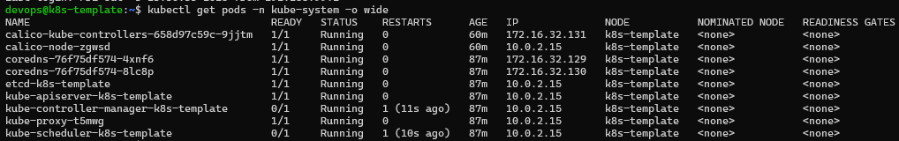

So Scheduler and Controller-Manager felt they need a restart so there is some instability in the system.
Let's see if we find anything in the logs
```bash
sudo crictl logs $(sudo crictl ps -q --name kube-controller-manager)
```
I0703 14:08:17.171993       1 shared_informer.go:318 Caches are synced for garbage collector
I0703 14:08:17.173319       1 garbagecollector.go:166 "All resource monitors have synced. Proceeding to collect garbage"
I0703 14:08:17.294145       1 shared_informer.go:311 Waiting for caches to sync for garbage collector
I0703 14:08:17.294183       1 shared_informer.go:318 Caches are synced for garbage collector
I0703 14:11:45.611623       1 node_lifecycle_controller.go:1045 "Controller detected that some Nodes are Ready. Exiting master disruption mode"

So we had issues with syncing and because not all the nodes are ready when we try to achieve HA with master nodes
we went into master disruption mode, thought these issues have fixed themselves, we are still hanging on the
etcd cluster health

I0703 14:08:16.141216       1 request.go:697 Waited for 3m45.233406115s due to client-side throttling

Im thinking that the system might not like the external drive I use because of poor I/O speeds, but im not sure how to prove that.
Ok so from the hypervisor we get an error message about cpu blocks, each master has 2 cores and it should be enough.
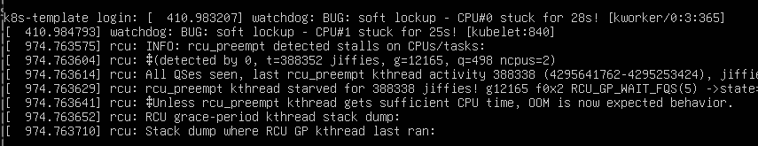

So on k8s-master1 running 
```bash
uptime

14:36:13 up  2:07,  1 user,  load average: 7.82, 6.91, 4.89
```
So the load averages are for 1, 5 and 15 minutes, essentianlly I had more runnable and blocked processes than the system could handle, likely becausee of low core ammount on CPU and disk I/O pressure, which increased load average and caused control-planes syncing issues.


Let's try to shutdown the VMs and bring back only the future Control Plane nodes.
Incresing CPU cores 2 < 4 per Master Node and Base Memory 2048 < 8192

Start master VMs
kubectl get nodes
control-plane is ready

kubectl get componentstatuses
Warning: v1 ComponentStatus is deprecated in v1.19+
NAME                 STATUS    MESSAGE   ERROR
controller-manager   Healthy   ok
scheduler            Healthy   ok
etcd-0               Healthy   ok

Trying to rejoin with master2 but had files so let's reset
sudo kubeadm reset -f
sudo systemctl restart containerd

kubectl get pods -n kube-system | grep etcd
1/1 Running

Retry joining master2 as control plane
```text
[check-etcd] Checking that the etcd cluster is healthy
error execution phase check-etcd: error syncing endpoints with etcd: context deadline exceeded
```
So we are responding too slowly still.
```bash 
kubectl get --raw='/readyz?verbose'
```
[+]ping ok
[+]log ok
[+]etcd ok
[+]etcd-readiness ok
[+]informer-sync ok
[+]poststarthook/start-kube-apiserver-admission-initializer ok
[+]poststarthook/generic-apiserver-start-informers ok
[+]poststarthook/priority-and-fairness-config-consumer ok
[+]poststarthook/priority-and-fairness-filter ok
[+]poststarthook/storage-object-count-tracker-hook ok
[+]poststarthook/start-apiextensions-informers ok
[+]poststarthook/start-apiextensions-controllers ok
[+]poststarthook/crd-informer-synced ok
[+]poststarthook/start-service-ip-repair-controllers ok
[+]poststarthook/rbac/bootstrap-roles ok
[+]poststarthook/scheduling/bootstrap-system-priority-classes ok
[+]poststarthook/priority-and-fairness-config-producer ok
[+]poststarthook/start-system-namespaces-controller ok
[+]poststarthook/bootstrap-controller ok
[+]poststarthook/start-cluster-authentication-info-controller ok
[+]poststarthook/start-kube-apiserver-identity-lease-controller ok
[+]poststarthook/start-kube-apiserver-identity-lease-garbage-collector ok
[+]poststarthook/start-legacy-token-tracking-controller ok
[+]poststarthook/aggregator-reload-proxy-client-cert ok
[+]poststarthook/start-kube-aggregator-informers ok
[+]poststarthook/apiservice-registration-controller ok
[+]poststarthook/apiservice-status-available-controller ok
[+]poststarthook/kube-apiserver-autoregistration ok
[+]autoregister-completion ok
[+]poststarthook/apiservice-openapi-controller ok
[+]poststarthook/apiservice-openapiv3-controller ok
[+]poststarthook/apiservice-discovery-controller ok
[+]shutdown ok
readyz check passed

Cheking ports for master communication
ss -tuln | grep -E '6443|2379|2380'


redoing master 1
sudo kubeadm init --control-plane-endpoint "192.168.99.101:6443" --upload-certs --apiserver-advertise-address=192.168.99.101

etcdserver: can only promote a learner member which is in sync with leader


Forget master 2
sudo crictl exec -it $(sudo crictl ps --name etcd -q) etcdctl \
  --cacert=/etc/kubernetes/pki/etcd/ca.crt \
  --cert=/etc/kubernetes/pki/etcd/server.crt \
  --key=/etc/kubernetes/pki/etcd/server.key \
  --endpoints=https://127.0.0.1:2379 member list

  sudo crictl exec -it $(sudo crictl ps --name etcd -q) etcdctl \
  --cacert=/etc/kubernetes/pki/etcd/ca.crt \
  --cert=/etc/kubernetes/pki/etcd/server.crt \
  --key=/etc/kubernetes/pki/etcd/server.key \
  --endpoints=https://127.0.0.1:2379 member remove 8af4c066902ba3f1

error execution phase kubelet-start: a Node with name "k8s-template" and status "Ready" already exists in the cluster.

rename host  and make persistent
sudo hostnamectl set-hostname k8s-master2
sudo sed -i 's/k8s-template/k8s-master2/g' /etc/hosts

Re install calico in master 2 

#### Adding k8s-master3 as 3rd control plane node to achiieve High Availability

##### Create a certificate in Master Node
```bash
sudo kubeadm init phase upload-certs --upload-certs
```
##### Create a token and hash in Master Node
```bash
kubeadm token create --print-join-command
```
##### Prepare master3 to join as Control Plane
Rename the host
```bash
sudo hostnamectl set-hostname k8s-master3
sudo sed -i 's/k8s-template/k8s-master3/g' /etc/hosts
```
Reset
```bash
sudo kubeadm reset -f
``` 
Add kubectl
```bash
mkdir -p $HOME/.kube
sudo cp -i /etc/kubernetes/admin.conf $HOME/.kube/config
sudo chown $(id -u):$(id -g) $HOME/.kube/config
```
Check nodes
```bash
kubectl get nodes -o wide
```
Note that if you have multiple network interfaces kubelet chooses the first one it finds.
Because our eth0 NAT is shared between VMs kubelet shows internal ip of 10.0.2.15 for all nodes.
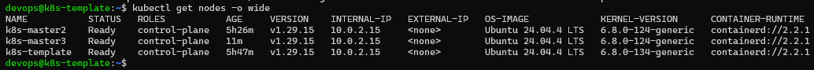
But watching the TLS-handshake we can see a direct connectionss inside the 192.168.99.0 network
```bash
curl -kv https://192.168.99.101:6443/livez
```
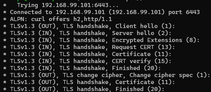


Check pods
```bash
kubectl get pods -n kube-system -o wide
```

```bash
ansible-playbook -i inventory.ini k8s-join.yaml
```
### Next steps
- Add load balancer for control plane (HA setup)
- Add GitOps (ArgoCD / Flux)
- Add monitoring stack (Prometheus + Grafana)
- Move to cloud-managed Kubernetes (EKS/GKE/AKS)

### Lesson learned
- The problem is almost always simpler than you think (Cable > Data Link > Network > Transport)
- Rename the hosts before initializing the control plane node
- Kubelet chooses the first network interface it finds